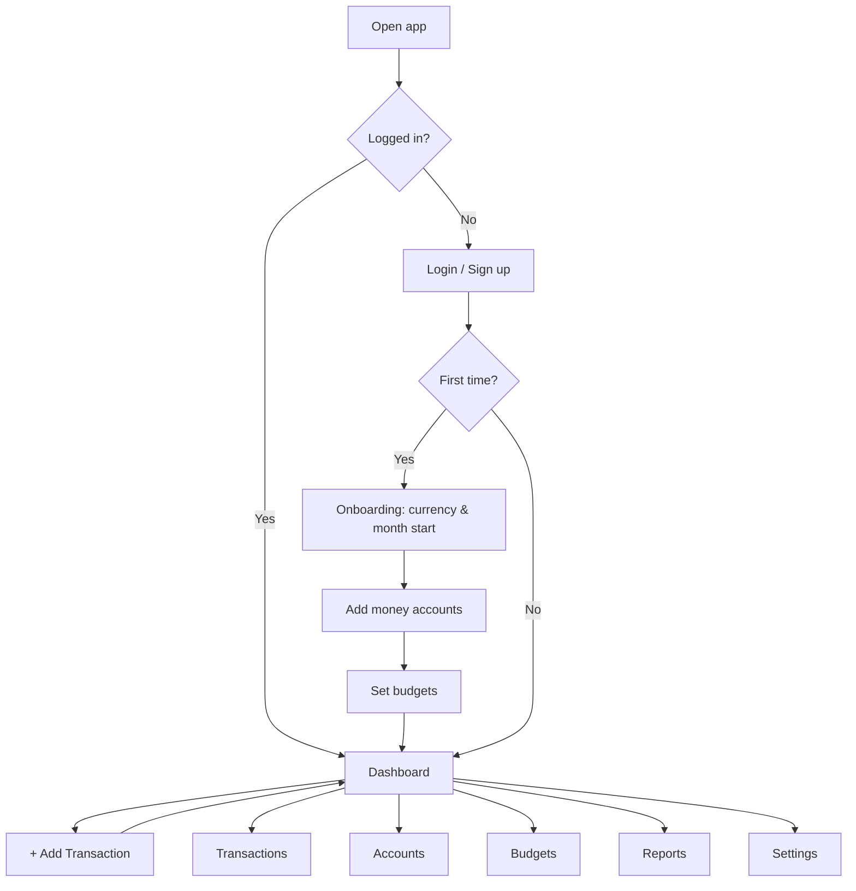
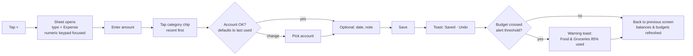
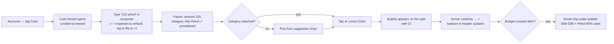
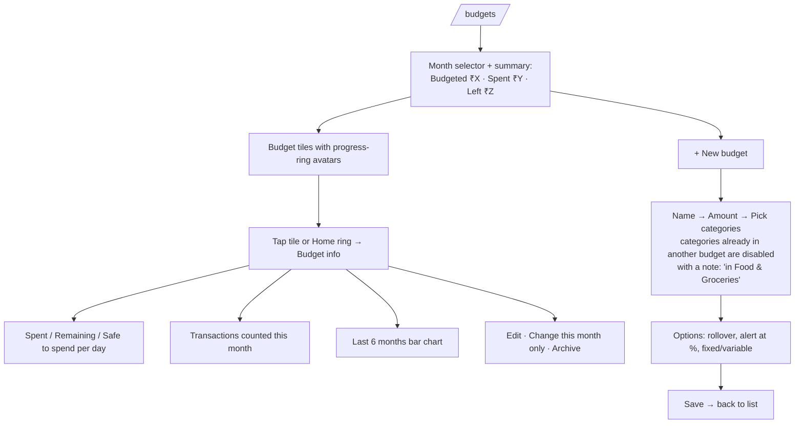
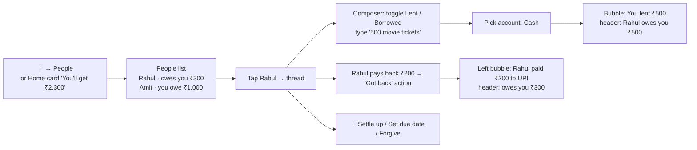

# App Flow

**Product:** HisaabChat (personal expense tracker)
**Date:** 2026-10-08 (revised: WhatsApp-inspired UI · Flutter for Android, Windows, Web)
**Related:** [PRD](01-PRD.md) · [UI/UX Design Brief](04-UI-UX-Design-Brief.md)

---

## 1. Sitemap

The paths below are **go_router** routes. On Web they're also the browser URLs.

```
Public
├── /              Splash: checks the stored token → /dashboard, /onboarding or /welcome
├── /welcome       Welcome screen (Get started / I already have an account)
├── /login
├── /signup
└── /forgot-password

Onboarding (first login only)
└── /onboarding    Step 1 Currency & month start → Step 2 Accounts → Step 3 Budgets → Done

App (authenticated)
├── /dashboard                     Home: balance card, budget rings row, upcoming, recent
├── /transactions                  Chat-list style list + search pill + filter chips
│   └── /transactions/new, /:id    Full transaction form (page / slide-in / dialog)
├── /accounts                      Accounts as a "chats" list + net worth
│   ├── /accounts/[id]             Account THREAD: transactions as bubbles + quick-add composer
│   └── /accounts/[id]/info        Account info (contact-info style)
├── /budgets                       Budgets list with progress-ring avatars
│   └── /budgets/[id]              Budget info: ring, stats, categories, history, transactions
├── /people                        Lend & borrow (v1.0): people list with balances (⋮ menu on phones, rail on desktop)
│   └── /people/[id]                Person THREAD: lent/borrowed/repaid bubbles + composer
├── /reports                       Category breakdown, trends (⋮ menu on phones)
└── /settings
    ├── /settings/profile          Name, currency, timezone, month start, theme
    ├── /settings/categories       Manage categories
    ├── /settings/recurring        Recurring rules & upcoming
    └── /settings/data             Export / delete account
```

**Primary navigation**: WhatsApp-style, chosen by window width, so it applies to Android, Windows and Web alike.
- **Compact (< 600 dp, phones), like WhatsApp Android:** app bar with the green app name, 🔍 and ⋮. Bottom `NavigationBar` with **Home · Transactions · Budgets · Accounts**. A green **FAB** at the bottom-right opens Add Transaction. The **⋮ menu** holds People, Reports, Categories, Recurring and Settings.
- **Medium (600–839 dp):** 64 dp icon rail + one full-width pane. Threads and info pages push over the list.
- **Expanded (≥ 840 dp, Windows/desktop web), like WhatsApp Desktop:** icon rail (sections at the top; Settings and the profile avatar at the bottom) + **list panel** + **detail pane** (account thread, budget info, transaction form). The detail pane shows a placeholder until something is selected.
- The full transaction form opens as a **full-screen page** (compact), a **dialog** (medium), or a **slide-in over the list panel** (expanded).
- **Keyboard (Windows/Web):** Ctrl+N new transaction, Ctrl+F search, Ctrl+1…5 switch sections, ↑/↓ move in lists, Enter open/send, Esc back/close, Del delete.

## 2. Overall Flow



## 3. Flow Details

### 3.1 Sign up & Onboarding
1. **Sign up**: name, email, password → account created → default categories seeded → access token stored securely on the device.
2. **Onboarding step 1, Preferences**: currency (default ₹ INR), month start day (default 1st). *Skip* is allowed.
3. **Onboarding step 2, Accounts**:
   - Pre-filled suggestions: **Cash**, **Bank Account**, **UPI Wallet**. Toggle on/off, rename, enter the current balance.
   - "+ Add another account".
   - At least one account is required to continue. If skipped, **Cash** with ₹0 is created.
4. **Onboarding step 3, Budgets**:
   - Suggested budget cards: **Room Rent**, **Food & Groceries**, **Bike EMI + Petrol**, **Education**. Each is pre-linked to its categories (e.g. Bike EMI + Petrol → *Bike EMI*, *Petrol*, *Bike Maintenance*).
   - The user enters a monthly amount for the ones they want; the rest are left off.
   - Shows "Total budgeted: ₹X". *Skip for now* is allowed.
5. **Done** → Home with a tip: "Open an account and type an amount to log your first expense."

### 3.2 Add Expense (the most frequent flow, optimized for speed)

- **Validation**: amount > 0; category required; account required.
- **Overspend**: if the expense makes a non-credit account negative, show a soft warning ("Cash will go to −₹50. Save anyway?"). It isn't blocked.
- **Save & add another**: a secondary button keeps the sheet open with the same account and date.
- **Windows/Web:** the same form as a dialog or slide-in. Ctrl+N opens it, Tab moves through fields, Enter saves, Esc closes.

### 3.2a Quick-add from an account thread (WhatsApp-style, fastest path)

- Saves to **the account whose thread is open**, dated **now**.
- 📎 opens the full form prefilled with what was typed (to change the date, set Repeat, or make it a Transfer).
- If saving fails: the bubble shows ⚠ "Not saved · Tap to retry", and the input is never lost.

### 3.3 Add Income
Same sheet with the **Income** tab selected. The category list shows income categories (Salary, Freelance…). On save, the account balance increases. Budgets aren't affected.

### 3.4 Transfer between accounts
1. **+** → **Transfer** tab.
2. Amount → **From** account → **To** account (the same account can't be picked twice) → date → note (e.g. "ATM withdrawal").
3. Save → From balance decreases, To balance increases. Not counted in income/expense totals or budgets.
4. A credit card bill payment is modeled as Transfer: Bank → Credit Card.

### 3.5 Edit / Delete Transaction
1. Tap a transaction tile or bubble → the full form opens in **edit mode** with values filled in.
2. Change any field (including type, account or amount) → Save → balances are recalculated (old effect reversed, new effect applied).
3. **Delete** → confirm dialog → deleted → toast with **Undo** (5 s).
4. **Long-press** a tile or bubble → WhatsApp-style selection mode (the app bar shows the count, 🗑 delete, ⧉ duplicate). Tap more items to select several.
5. Android: swipe left on a tile → delete with Undo. Windows/Web: hover chevron ⌄ or right-click → Edit / Duplicate / Delete; the Del key deletes the selection.

### 3.6 Transactions List
- Chat-list style tiles (category avatar · category · `Account · note` · amount + time), grouped under small headers like `TODAY · −₹540`. Newest first, infinite scroll.
- Top: **search pill** (note or category name), then **filter chips**: All · Expense · Income · Transfer · `This month ▾` (month picker).
- The ⋮ menu has **More filters** (accounts, categories, date range, amount range) and a summary for the period (Income / Expense / Net).
- Empty state: "No transactions this month. Tap + to add one."

### 3.7 Accounts
1. `/accounts`: **Net worth** card, then one **chat-style tile per account**: avatar, name, last transaction as the preview line, balance + last activity time on the right. Sorted by recent activity; long-press → 📌 Pin to keep one on top. Credit cards show "Outstanding ₹X".
2. **＋ (FAB / panel header) → New account** form: name, type, opening balance, color/icon, include in total (toggle), credit limit (credit cards only).
3. Tap an account → **Account thread**: money out on the right, money in on the left, transfers shown on both accounts' threads, adjustments as centered system chips, and the quick-add composer at the bottom (see 3.2a).
4. Tap the thread header → **Account info**: balance, month in/out, Edit, **Reconcile balance** ("What's the actual balance?" → creates an adjustment), Export, then **Archive** / **Delete** (only if no transactions) in red.

### 3.8 Budgets

- **Unbudgeted spending**: a card at the bottom shows "Other spending (not in any budget): ₹X" so nothing is hidden.
- **Status colors**: the ring and % pill are green (< alert %), amber (≥ alert %) or red (> 100%), always paired with text ("Over by ₹350").
- **Home** shows the same rings as a horizontal row (like WhatsApp's status row). Tapping one opens that budget's info.

### 3.9 Recurring Transactions
1. Create from the Add Transaction sheet ("Repeat: Monthly on day 5") or from **Settings → Recurring → + New**.
2. Each rule: template (type, amount, account, category, note), frequency, start date, end date (optional), **auto-add** or **remind me**.
3. Home shows an **"Upcoming"** section with a green count badge: "Bike EMI ₹3,200 · due in 2 days".
4. On the due date:
   - Auto-add → the transaction is created and appears in the list with a 🔁 badge.
   - Remind → a "Pending" tile on Home with **Confirm** (opens the prefilled form so the amount can be adjusted) or **Skip**.

### 3.10 Reports
- Tabs: **Spending** | **Income** | **Trend**.
- Spending: period selector → donut chart by category + ranked list (category, amount, % of total). Tap a category → transactions filtered to it.
- Trend: last 6/12 months income vs. expense bars + net savings line.
- **Export CSV** button (uses the current period). Web → browser download; Windows → Save As dialog; Android → share sheet.

### 3.11 Settings (WhatsApp-style: profile header + icon rows)
- **Profile header**: initials avatar, name, email → tap to edit name.
- **Account**: currency, timezone, month start day.
- **Appearance**: theme (System/Light/Dark), thread wallpaper (Doodle/Plain/None), font size, Reduce motion.
- **Categories**: Expense / Income tabs, list with color and icon; add, edit, archive; drag to reorder.
- **Recurring**: rules list + upcoming.
- **Data**: export all (CSV/JSON), delete account (type "DELETE" to confirm).
- **Log out** / **Log out of all devices**.

### 3.12 Lend & Borrow with People (v1.0)

- **Lend** = money out of your account (right bubble); **Borrow** = money in (left bubble). **Collect** and **Repay** settle the balance partly or fully.
- These entries update account balances but never appear in income/expense totals or budgets.
- A due date adds an item to Home → Upcoming ("Amit: repay ₹1,000 · due Friday").

## 4. Key States & Edge Cases

| Situation | Behavior |
|---|---|
| No accounts yet | Add Transaction is disabled, with the prompt "Add an account first" |
| Composer text has no number | ➤ stays disabled; hint "Start with an amount, e.g. 120 tea" |
| Composer words match no category | Suggestion chips show recent categories; one must be picked before sending |
| Save fails from the composer | Bubble shows ⚠ "Not saved · Tap to retry"; nothing is lost |
| Category archived | Hidden from pickers; past transactions still show it (greyed) |
| Account archived | Hidden from pickers and totals (optional toggle); history kept |
| Category moved between budgets | Past months recalculate against the current mapping (documented behavior) |
| Transaction dated in a past month | Past month's budget spend updates |
| Budget with no categories | Not allowed. At least one category is required |
| Edit changes Expense → Transfer | Category is cleared, "To account" is required; balances are fully re-applied |
| Network error on save | Sheet stays open with entered data and a retry button |
| Token expired or revoked (401) | Clear the stored token, redirect to login, then return to the original page |
| No internet connection | "Waiting for network…" banner; forms keep entered data; composer bubbles stay 🕒 and retry |
| Window resized (Windows/Web) | Layout switches live between compact, medium and expanded without losing state |
| Same data edited on two devices | Last write wins; lists refresh on screen focus and on pull-to-refresh |
