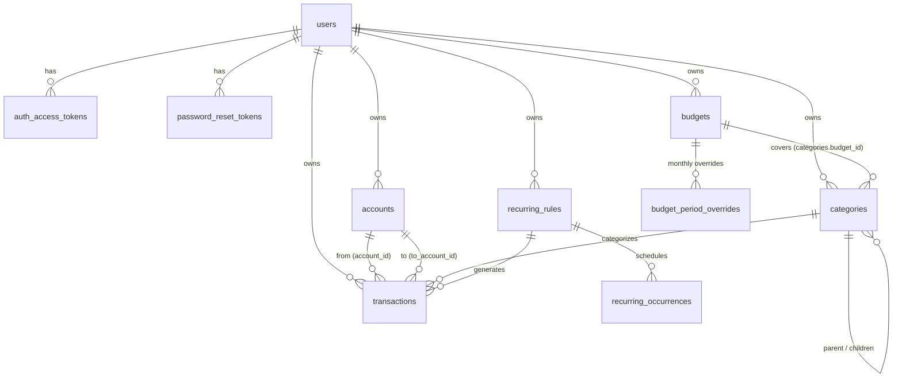

# Backend Schema

**Product:** HisaabChat (personal expense tracker)
**Database:** MariaDB 11.4 LTS (compatible with MySQL 8.4 LTS) · **ORM:** AdonisJS Lucid
**Date:** 2026-10-08 (revised for AdonisJS + MariaDB/MySQL)
**Related:** [TRD](02-TRD.md)

---

## 1. Entity Relationship Diagram



**Key design point:** a budget covers one or more categories through `categories.budget_id`. Since a category has a single `budget_id`, it can only ever belong to **one** budget, so the database itself prevents double counting.

## 2. Conventions
- **Primary keys:** UUID v7, `CHAR(36)`, generated in the app (Lucid `selfAssignPrimaryKey = true`). The exception is `auth_access_tokens`, which keeps Adonis's default auto-increment.
- **Money:** signed `BIGINT` in **paise**. Transaction amounts are `> 0`.
- **Time:** `DATETIME(3)` in **UTC** (connection `timezone: 'Z'`). Each table has `created_at` and `updated_at`.
- **Soft delete:** `archived_at` on accounts, categories and budgets.
- **Naming:** snake_case in the DB, camelCase in models and JSON.
- **Engine:** InnoDB, `utf8mb4` / `utf8mb4_unicode_ci`.
- Every user-owned table has `user_id`, and every query filters by it.

## 3. DDL (reference, MariaDB/MySQL compatible)

> Lucid migrations in `backend/database/migrations` are the source of truth. This DDL shows exactly what they must produce. CHECK constraints are added with `this.schema.raw(...)` in the migrations.

```sql
-- ───────────────────────── users & auth ─────────────────────────
CREATE TABLE users (
  id               CHAR(36)      NOT NULL PRIMARY KEY,
  full_name        VARCHAR(100)  NULL,
  email            VARCHAR(254)  NOT NULL,
  password         VARCHAR(255)  NOT NULL,
  currency         CHAR(3)       NOT NULL DEFAULT 'INR',
  locale           VARCHAR(10)   NOT NULL DEFAULT 'en-IN',
  timezone         VARCHAR(64)   NOT NULL DEFAULT 'Asia/Kolkata',
  month_start_day  TINYINT       NOT NULL DEFAULT 1,
  theme            ENUM('SYSTEM','LIGHT','DARK') NOT NULL DEFAULT 'SYSTEM',
  onboarded_at     DATETIME(3)   NULL,
  created_at       DATETIME(3)   NOT NULL,
  updated_at       DATETIME(3)   NOT NULL,
  UNIQUE KEY uq_users_email (email),
  CONSTRAINT chk_users_month_start CHECK (month_start_day BETWEEN 1 AND 28)
) ENGINE=InnoDB DEFAULT CHARSET=utf8mb4 COLLATE=utf8mb4_unicode_ci;

-- Created by `node ace configure @adonisjs/auth --guard=access_tokens` (tokenable_id adjusted to CHAR(36))
CREATE TABLE auth_access_tokens (
  id            INT UNSIGNED  NOT NULL AUTO_INCREMENT PRIMARY KEY,
  tokenable_id  CHAR(36)      NOT NULL,
  type          VARCHAR(255)  NOT NULL,
  name          VARCHAR(255)  NULL,          -- e.g. "Android · Pixel 7", "Windows", "Web"
  hash          VARCHAR(255)  NOT NULL,
  abilities     TEXT          NOT NULL,
  created_at    DATETIME(3)   NULL,
  updated_at    DATETIME(3)   NULL,
  last_used_at  DATETIME(3)   NULL,
  expires_at    DATETIME(3)   NULL,
  CONSTRAINT fk_tokens_user FOREIGN KEY (tokenable_id) REFERENCES users(id) ON DELETE CASCADE
) ENGINE=InnoDB;

CREATE TABLE password_reset_tokens (
  id          CHAR(36)     NOT NULL PRIMARY KEY,
  user_id     CHAR(36)     NOT NULL,
  token_hash  CHAR(64)     NOT NULL,          -- sha256 of the emailed token
  expires_at  DATETIME(3)  NOT NULL,
  used_at     DATETIME(3)  NULL,
  created_at  DATETIME(3)  NOT NULL,
  UNIQUE KEY uq_prt_hash (token_hash),
  CONSTRAINT fk_prt_user FOREIGN KEY (user_id) REFERENCES users(id) ON DELETE CASCADE
) ENGINE=InnoDB;

-- ───────────────────────── money accounts ─────────────────────────
CREATE TABLE accounts (
  id                CHAR(36)     NOT NULL PRIMARY KEY,
  user_id           CHAR(36)     NOT NULL,
  name              VARCHAR(60)  NOT NULL,
  type              ENUM('CASH','BANK','WALLET','CREDIT_CARD','SAVINGS','OTHER') NOT NULL,
  opening_balance   BIGINT       NOT NULL DEFAULT 0,   -- paise; may be negative (credit card)
  balance           BIGINT       NOT NULL DEFAULT 0,   -- cached current balance (paise)
  credit_limit      BIGINT       NULL,                 -- credit cards only
  color             CHAR(7)      NOT NULL DEFAULT '#4F46E5',
  icon              VARCHAR(40)  NOT NULL DEFAULT 'account_balance_wallet',
  include_in_total  BOOLEAN      NOT NULL DEFAULT TRUE,
  sort_order        INT          NOT NULL DEFAULT 0,
  archived_at       DATETIME(3)  NULL,
  created_at        DATETIME(3)  NOT NULL,
  updated_at        DATETIME(3)  NOT NULL,
  UNIQUE KEY uq_accounts_user_name (user_id, name),
  KEY idx_accounts_user_archived (user_id, archived_at),
  CONSTRAINT fk_accounts_user FOREIGN KEY (user_id) REFERENCES users(id) ON DELETE CASCADE
) ENGINE=InnoDB;

-- ───────────────────────── budgets ─────────────────────────
CREATE TABLE budgets (
  id             CHAR(36)     NOT NULL PRIMARY KEY,
  user_id        CHAR(36)     NOT NULL,
  name           VARCHAR(60)  NOT NULL,                 -- "Bike EMI + Petrol"
  amount         BIGINT       NOT NULL,                 -- default per period (paise)
  period         ENUM('MONTHLY','WEEKLY','YEARLY') NOT NULL DEFAULT 'MONTHLY',  -- v1: MONTHLY only
  kind           ENUM('FIXED','VARIABLE') NOT NULL DEFAULT 'VARIABLE',
  start_date     DATE         NOT NULL,                 -- first period it applies to
  rollover       BOOLEAN      NOT NULL DEFAULT FALSE,
  alert_percent  TINYINT      NOT NULL DEFAULT 80,
  color          CHAR(7)      NOT NULL DEFAULT '#4F46E5',
  icon           VARCHAR(40)  NOT NULL DEFAULT 'savings',
  sort_order     INT          NOT NULL DEFAULT 0,
  archived_at    DATETIME(3)  NULL,
  created_at     DATETIME(3)  NOT NULL,
  updated_at     DATETIME(3)  NOT NULL,
  UNIQUE KEY uq_budgets_user_name (user_id, name),
  KEY idx_budgets_user_archived (user_id, archived_at),
  CONSTRAINT fk_budgets_user FOREIGN KEY (user_id) REFERENCES users(id) ON DELETE CASCADE,
  CONSTRAINT chk_budgets_amount CHECK (amount >= 0),
  CONSTRAINT chk_budgets_alert  CHECK (alert_percent BETWEEN 1 AND 100)
) ENGINE=InnoDB;

CREATE TABLE budget_period_overrides (
  id            CHAR(36)     NOT NULL PRIMARY KEY,
  budget_id     CHAR(36)     NOT NULL,
  period_start  DATE         NOT NULL,      -- local date the period starts on
  amount        BIGINT       NOT NULL,
  created_at    DATETIME(3)  NOT NULL,
  updated_at    DATETIME(3)  NOT NULL,
  UNIQUE KEY uq_bpo_budget_period (budget_id, period_start),
  CONSTRAINT fk_bpo_budget FOREIGN KEY (budget_id) REFERENCES budgets(id) ON DELETE CASCADE,
  CONSTRAINT chk_bpo_amount CHECK (amount >= 0)
) ENGINE=InnoDB;

-- ───────────────────────── categories ─────────────────────────
CREATE TABLE categories (
  id           CHAR(36)     NOT NULL PRIMARY KEY,
  user_id      CHAR(36)     NOT NULL,
  name         VARCHAR(40)  NOT NULL,
  type         ENUM('INCOME','EXPENSE') NOT NULL,
  parent_id    CHAR(36)     NULL,           -- one level of nesting
  budget_id    CHAR(36)     NULL,           -- EXPENSE only; at most one budget per category
  color        CHAR(7)      NOT NULL,
  icon         VARCHAR(40)  NOT NULL,
  is_default   BOOLEAN      NOT NULL DEFAULT FALSE,
  sort_order   INT          NOT NULL DEFAULT 0,
  archived_at  DATETIME(3)  NULL,
  created_at   DATETIME(3)  NOT NULL,
  updated_at   DATETIME(3)  NOT NULL,
  UNIQUE KEY uq_categories_user_type_name (user_id, type, name),
  KEY idx_categories_user_type (user_id, type, archived_at),
  KEY idx_categories_budget (budget_id),
  CONSTRAINT fk_categories_user   FOREIGN KEY (user_id)   REFERENCES users(id)      ON DELETE CASCADE,
  CONSTRAINT fk_categories_parent FOREIGN KEY (parent_id) REFERENCES categories(id),
  CONSTRAINT fk_categories_budget FOREIGN KEY (budget_id) REFERENCES budgets(id)    ON DELETE SET NULL
) ENGINE=InnoDB;

-- ───────────────────────── recurring ─────────────────────────
CREATE TABLE recurring_rules (
  id             CHAR(36)     NOT NULL PRIMARY KEY,
  user_id        CHAR(36)     NOT NULL,
  type           ENUM('INCOME','EXPENSE','TRANSFER') NOT NULL,
  amount         BIGINT       NOT NULL,
  account_id     CHAR(36)     NOT NULL,
  to_account_id  CHAR(36)     NULL,
  category_id    CHAR(36)     NULL,
  note           VARCHAR(200) NULL,
  frequency      ENUM('DAILY','WEEKLY','MONTHLY','YEARLY') NOT NULL,
  `interval`     SMALLINT     NOT NULL DEFAULT 1,
  day_of_month   TINYINT      NULL,          -- MONTHLY: 1..31 (clamped to month end)
  start_date     DATE         NOT NULL,
  end_date       DATE         NULL,
  next_run_at    DATETIME(3)  NOT NULL,      -- UTC instant of the next occurrence
  auto_create    BOOLEAN      NOT NULL DEFAULT FALSE,
  is_active      BOOLEAN      NOT NULL DEFAULT TRUE,
  created_at     DATETIME(3)  NOT NULL,
  updated_at     DATETIME(3)  NOT NULL,
  KEY idx_rr_due (is_active, next_run_at),
  KEY idx_rr_user (user_id),
  CONSTRAINT fk_rr_user     FOREIGN KEY (user_id)       REFERENCES users(id) ON DELETE CASCADE,
  CONSTRAINT fk_rr_account  FOREIGN KEY (account_id)    REFERENCES accounts(id),
  CONSTRAINT fk_rr_to       FOREIGN KEY (to_account_id) REFERENCES accounts(id),
  CONSTRAINT fk_rr_category FOREIGN KEY (category_id)   REFERENCES categories(id),
  CONSTRAINT chk_rr_amount  CHECK (amount > 0)
) ENGINE=InnoDB;

-- ───────────────────────── transactions ─────────────────────────
CREATE TABLE transactions (
  id                    CHAR(36)     NOT NULL PRIMARY KEY,   -- client-generated UUID v7 (idempotent create)
  user_id               CHAR(36)     NOT NULL,
  type                  ENUM('INCOME','EXPENSE','TRANSFER','ADJUSTMENT') NOT NULL,
  amount                BIGINT       NOT NULL,               -- paise, > 0
  date                  DATETIME(3)  NOT NULL,               -- when it happened (UTC)
  note                  VARCHAR(200) NULL,
  account_id            CHAR(36)     NOT NULL,               -- source account
  to_account_id         CHAR(36)     NULL,                   -- TRANSFER only
  category_id           CHAR(36)     NULL,                   -- INCOME / EXPENSE only
  adjustment_direction  ENUM('INCREASE','DECREASE') NULL,    -- ADJUSTMENT only
  recurring_rule_id     CHAR(36)     NULL,
  occurrence_date       DATE         NULL,
  created_at            DATETIME(3)  NOT NULL,
  updated_at            DATETIME(3)  NOT NULL,

  UNIQUE KEY uq_txn_recurring (recurring_rule_id, occurrence_date),
  KEY idx_txn_user_date     (user_id, date, id),          -- list + cursor pagination
  KEY idx_txn_user_cat_date (user_id, category_id, date), -- budgets & reports
  KEY idx_txn_account_date  (account_id, date),
  KEY idx_txn_to_date       (to_account_id, date),

  CONSTRAINT fk_txn_user      FOREIGN KEY (user_id)           REFERENCES users(id) ON DELETE CASCADE,
  -- No ON DELETE action on the next three: MySQL forbids referential actions on columns used in CHECK.
  CONSTRAINT fk_txn_account   FOREIGN KEY (account_id)        REFERENCES accounts(id),
  CONSTRAINT fk_txn_to        FOREIGN KEY (to_account_id)     REFERENCES accounts(id),
  CONSTRAINT fk_txn_category  FOREIGN KEY (category_id)       REFERENCES categories(id),
  CONSTRAINT fk_txn_rule      FOREIGN KEY (recurring_rule_id) REFERENCES recurring_rules(id) ON DELETE SET NULL,

  CONSTRAINT chk_txn_amount CHECK (amount > 0),
  CONSTRAINT chk_txn_shape CHECK (
       (type IN ('INCOME','EXPENSE') AND category_id IS NOT NULL AND to_account_id IS NULL AND adjustment_direction IS NULL)
    OR (type = 'TRANSFER'   AND to_account_id IS NOT NULL AND to_account_id <> account_id AND category_id IS NULL AND adjustment_direction IS NULL)
    OR (type = 'ADJUSTMENT' AND adjustment_direction IS NOT NULL AND category_id IS NULL AND to_account_id IS NULL)
  )
) ENGINE=InnoDB;

CREATE TABLE recurring_occurrences (
  id                 CHAR(36)     NOT NULL PRIMARY KEY,
  recurring_rule_id  CHAR(36)     NOT NULL,
  due_date           DATE         NOT NULL,
  status             ENUM('PENDING','CONFIRMED','SKIPPED') NOT NULL DEFAULT 'PENDING',
  transaction_id     CHAR(36)     NULL,
  created_at         DATETIME(3)  NOT NULL,
  updated_at         DATETIME(3)  NOT NULL,
  UNIQUE KEY uq_ro_rule_due (recurring_rule_id, due_date),
  UNIQUE KEY uq_ro_txn (transaction_id),
  KEY idx_ro_status (status),
  CONSTRAINT fk_ro_rule FOREIGN KEY (recurring_rule_id) REFERENCES recurring_rules(id) ON DELETE CASCADE,
  CONSTRAINT fk_ro_txn  FOREIGN KEY (transaction_id)    REFERENCES transactions(id)    ON DELETE SET NULL
) ENGINE=InnoDB;
```

**Service-level rules** (not expressible in SQL on both databases):
- `categories.budget_id` may only be set on EXPENSE categories owned by the same user.
- `transactions.category_id` must have a matching type (INCOME↔INCOME, EXPENSE↔EXPENSE).
- Referenced accounts and categories must belong to the same `user_id` and not be archived (at write time).
- Deleting a user (`DELETE /me`) deletes rows in this order inside one DB transaction: recurring_occurrences → transactions → recurring_rules → categories → budget_period_overrides → budgets → accounts → tokens → user.

### 3.1 People: Lend & Borrow (v1.0, Phase 6 migration)

```sql
CREATE TABLE people (
  id           CHAR(36)     NOT NULL PRIMARY KEY,
  user_id      CHAR(36)     NOT NULL,
  name         VARCHAR(60)  NOT NULL,
  phone        VARCHAR(20)  NULL,
  note         VARCHAR(200) NULL,
  color        CHAR(7)      NOT NULL DEFAULT '#1DAA61',
  archived_at  DATETIME(3)  NULL,
  created_at   DATETIME(3)  NOT NULL,
  updated_at   DATETIME(3)  NOT NULL,
  UNIQUE KEY uq_people_user_name (user_id, name),
  CONSTRAINT fk_people_user FOREIGN KEY (user_id) REFERENCES users(id) ON DELETE CASCADE
) ENGINE=InnoDB;

ALTER TABLE transactions
  MODIFY type ENUM('INCOME','EXPENSE','TRANSFER','ADJUSTMENT','LEND','BORROW','COLLECT','REPAY') NOT NULL,
  ADD COLUMN person_id CHAR(36) NULL AFTER category_id,
  ADD COLUMN due_date DATE NULL AFTER person_id,              -- optional, LEND/BORROW only
  ADD KEY idx_txn_person_date (person_id, date),
  ADD CONSTRAINT fk_txn_person FOREIGN KEY (person_id) REFERENCES people(id),
  DROP CONSTRAINT chk_txn_shape,
  ADD CONSTRAINT chk_txn_shape CHECK (
       (type IN ('INCOME','EXPENSE') AND category_id IS NOT NULL AND to_account_id IS NULL AND person_id IS NULL AND adjustment_direction IS NULL)
    OR (type = 'TRANSFER'   AND to_account_id IS NOT NULL AND to_account_id <> account_id AND category_id IS NULL AND person_id IS NULL AND adjustment_direction IS NULL)
    OR (type = 'ADJUSTMENT' AND adjustment_direction IS NOT NULL AND category_id IS NULL AND to_account_id IS NULL AND person_id IS NULL)
    OR (type IN ('LEND','BORROW','COLLECT','REPAY') AND person_id IS NOT NULL AND category_id IS NULL AND to_account_id IS NULL AND adjustment_direction IS NULL)
  );
```

**Person balance** (positive = they owe you):
```sql
SELECT p.id, p.name,
       COALESCE(SUM(CASE t.type WHEN 'LEND' THEN t.amount WHEN 'REPAY' THEN t.amount
                                WHEN 'BORROW' THEN -t.amount WHEN 'COLLECT' THEN -t.amount END), 0) AS balance
FROM people p
LEFT JOIN transactions t ON t.person_id = p.id
WHERE p.user_id = :userId AND p.archived_at IS NULL
GROUP BY p.id, p.name;
```

## 4. Lucid Migration & Model Examples

```ts
// backend/database/migrations/1728370000005_create_transactions_table.ts
import { BaseSchema } from '@adonisjs/lucid/schema'

export default class extends BaseSchema {
  protected tableName = 'transactions'

  async up() {
    this.schema.createTable(this.tableName, (table) => {
      table.uuid('id').primary()                     // CHAR(36) on MySQL/MariaDB
      table.uuid('user_id').notNullable().references('users.id').onDelete('CASCADE')
      table.enum('type', ['INCOME', 'EXPENSE', 'TRANSFER', 'ADJUSTMENT']).notNullable()
      table.bigInteger('amount').notNullable()
      table.dateTime('date', { precision: 3 }).notNullable()
      table.string('note', 200).nullable()
      table.uuid('account_id').notNullable().references('accounts.id')
      table.uuid('to_account_id').nullable().references('accounts.id')
      table.uuid('category_id').nullable().references('categories.id')
      table.enum('adjustment_direction', ['INCREASE', 'DECREASE']).nullable()
      table.uuid('recurring_rule_id').nullable().references('recurring_rules.id').onDelete('SET NULL')
      table.date('occurrence_date').nullable()
      table.dateTime('created_at', { precision: 3 }).notNullable()
      table.dateTime('updated_at', { precision: 3 }).notNullable()

      table.unique(['recurring_rule_id', 'occurrence_date'])
      table.index(['user_id', 'date', 'id'])
      table.index(['user_id', 'category_id', 'date'])
      table.index(['account_id', 'date'])
      table.index(['to_account_id', 'date'])
    })

    this.schema.raw(`ALTER TABLE transactions ADD CONSTRAINT chk_txn_amount CHECK (amount > 0)`)
    this.schema.raw(`ALTER TABLE transactions ADD CONSTRAINT chk_txn_shape CHECK ( ... see DDL ... )`)
  }

  async down() {
    this.schema.dropTable(this.tableName)
  }
}
```

```ts
// backend/app/models/transaction.ts
import { BaseModel, beforeCreate, belongsTo, column } from '@adonisjs/lucid/orm'
import type { BelongsTo } from '@adonisjs/lucid/types/relations'
import { DateTime } from 'luxon'
import { v7 as uuidv7 } from 'uuid'
import Account from '#models/account'
import Category from '#models/category'

export type TransactionType = 'INCOME' | 'EXPENSE' | 'TRANSFER' | 'ADJUSTMENT'

export default class Transaction extends BaseModel {
  static selfAssignPrimaryKey = true

  @column({ isPrimary: true }) declare id: string
  @column() declare userId: string
  @column() declare type: TransactionType
  @column({ consume: (v) => Number(v) }) declare amount: number
  @column.dateTime() declare date: DateTime
  @column() declare note: string | null
  @column() declare accountId: string
  @column() declare toAccountId: string | null
  @column() declare categoryId: string | null
  @column() declare adjustmentDirection: 'INCREASE' | 'DECREASE' | null
  @column() declare recurringRuleId: string | null
  @column.date() declare occurrenceDate: DateTime | null
  @column.dateTime({ autoCreate: true }) declare createdAt: DateTime
  @column.dateTime({ autoCreate: true, autoUpdate: true }) declare updatedAt: DateTime

  @belongsTo(() => Account) declare account: BelongsTo<typeof Account>
  @belongsTo(() => Account, { foreignKey: 'toAccountId' }) declare toAccount: BelongsTo<typeof Account>
  @belongsTo(() => Category) declare category: BelongsTo<typeof Category>

  @beforeCreate()
  static assignId(t: Transaction) {
    t.id ??= uuidv7()
  }
}
```

```ts
// backend/config/database.ts (excerpt)
connections: {
  mysql: {
    client: 'mysql2',
    connection: {
      host: env.get('DB_HOST'), port: env.get('DB_PORT'),
      user: env.get('DB_USER'), password: env.get('DB_PASSWORD'), database: env.get('DB_DATABASE'),
      timezone: 'Z',            // store & read DATETIME as UTC
      decimalNumbers: true,     // SUM() results as numbers, not strings
      supportBigNumbers: true,
      charset: 'utf8mb4',
    },
    migrations: { naturalSort: true, paths: ['database/migrations'] },
  },
}
```

## 5. Balance Logic (reference implementation)

```ts
// backend/app/services/balance_service.ts
import type { TransactionClientContract } from '@adonisjs/lucid/types/database'

type Effect = { accountId: string; delta: number }
type TxnLike = {
  type: 'INCOME' | 'EXPENSE' | 'TRANSFER' | 'ADJUSTMENT'
  amount: number; accountId: string; toAccountId?: string | null
  adjustmentDirection?: 'INCREASE' | 'DECREASE' | null
}

export function effectsOf(t: TxnLike): Effect[] {
  switch (t.type) {
    case 'INCOME':     return [{ accountId: t.accountId, delta: t.amount }]
    case 'EXPENSE':    return [{ accountId: t.accountId, delta: -t.amount }]
    case 'TRANSFER':   return [{ accountId: t.accountId, delta: -t.amount },
                               { accountId: t.toAccountId!, delta: t.amount }]
    case 'ADJUSTMENT': return [{ accountId: t.accountId,
                                 delta: t.adjustmentDirection === 'INCREASE' ? t.amount : -t.amount }]
    // v1.0 lend & borrow
    case 'LEND':
    case 'REPAY':      return [{ accountId: t.accountId, delta: -t.amount }]
    case 'BORROW':
    case 'COLLECT':    return [{ accountId: t.accountId, delta: t.amount }]
  }
}

export const negate = (effects: Effect[]) => effects.map((e) => ({ ...e, delta: -e.delta }))

export async function applyEffects(trx: TransactionClientContract, effects: Effect[]) {
  for (const e of effects) {
    await trx.from('accounts').where('id', e.accountId).increment('balance', e.delta)
  }
}

// In TransactionService (all inside db.transaction(async (trx) => { ... })):
//   create: insert → applyEffects(trx, effectsOf(new))
//   update: old = Transaction.query({ client: trx }).where({ id, userId }).forUpdate().firstOrFail()
//           applyEffects(trx, negate(effectsOf(old))) → save new values → applyEffects(trx, effectsOf(new))
//   delete: lock → applyEffects(trx, negate(effectsOf(old))) → delete
```

**Integrity check** (`node ace balances:check`), which should return zero rows:
```sql
SELECT a.id, a.balance, a.opening_balance + COALESCE(SUM(e.delta), 0) AS computed
FROM accounts a
LEFT JOIN (
  SELECT account_id,
         CASE type
           WHEN 'INCOME'     THEN amount
           WHEN 'EXPENSE'    THEN -amount
           WHEN 'TRANSFER'   THEN -amount
           WHEN 'ADJUSTMENT' THEN IF(adjustment_direction = 'INCREASE', amount, -amount)
         END AS delta
  FROM transactions
  UNION ALL
  SELECT to_account_id, amount FROM transactions WHERE type = 'TRANSFER'
) e ON e.account_id = a.id
GROUP BY a.id, a.balance, a.opening_balance
HAVING a.balance <> computed;
```

## 6. Budget Spend Query

```sql
-- Parameters: :userId, :from, :to (UTC instants of the period), :periodStart (local DATE)
SELECT b.id, b.name, b.kind, b.color, b.icon, b.alert_percent, b.rollover,
       COALESCE(o.amount, b.amount) AS budgeted,
       COALESCE(s.spent, 0)         AS spent
FROM budgets b
LEFT JOIN budget_period_overrides o
       ON o.budget_id = b.id AND o.period_start = :periodStart
LEFT JOIN (
    SELECT COALESCE(c.budget_id, p.budget_id) AS budget_id,   -- sub-category inherits parent's budget
           SUM(t.amount)                       AS spent
    FROM transactions t
    JOIN categories c      ON c.id = t.category_id
    LEFT JOIN categories p ON p.id = c.parent_id
    WHERE t.user_id = :userId
      AND t.type = 'EXPENSE'
      AND t.date >= :from AND t.date < :to
    GROUP BY COALESCE(c.budget_id, p.budget_id)
) s ON s.budget_id = b.id
WHERE b.user_id = :userId AND b.archived_at IS NULL
ORDER BY b.sort_order, b.name;
```
- The same subquery's `budget_id IS NULL` row gives the **unbudgeted spending** total.
- Derived in `BudgetService`: `rolloverIn`, `remaining = budgeted + rolloverIn − spent`, `percent`, `status`, `safeToSpendPerDay`.

## 7. Seed Data (per new user)

Seeded by `UserDefaultsService.seed(user, trx)` during registration. Icon keys refer to Material Symbols names, which the Flutter app maps to `IconData`.

| Type | Name | Icon key | Color |
|---|---|---|---|
| EXPENSE | Room Rent | `home` | `#4F46E5` |
| EXPENSE | Food & Groceries | `shopping_cart` | `#10B981` |
| EXPENSE | Eating Out | `restaurant` | `#F97316` |
| EXPENSE | Bike EMI | `two_wheeler` | `#8B5CF6` |
| EXPENSE | Petrol | `local_gas_station` | `#F59E0B` |
| EXPENSE | Bike Maintenance | `build` | `#64748B` |
| EXPENSE | Education | `school` | `#0EA5E9` |
| EXPENSE | Utilities | `bolt` | `#06B6D4` |
| EXPENSE | Mobile & Internet | `wifi` | `#14B8A6` |
| EXPENSE | Shopping | `shopping_bag` | `#EC4899` |
| EXPENSE | Health | `medical_services` | `#F43F5E` |
| EXPENSE | Entertainment | `movie` | `#84CC16` |
| EXPENSE | Travel | `flight` | `#0EA5E9` |
| EXPENSE | Personal Care | `spa` | `#EC4899` |
| EXPENSE | Gifts | `redeem` | `#F43F5E` |
| EXPENSE | Other | `more_horiz` | `#64748B` |
| INCOME | Salary | `work` | `#16A34A` |
| INCOME | Freelance | `laptop` | `#14B8A6` |
| INCOME | Pocket Money / Family | `family_restroom` | `#4F46E5` |
| INCOME | Interest | `percent` | `#10B981` |
| INCOME | Refund | `undo` | `#06B6D4` |
| INCOME | Other Income | `add_circle` | `#64748B` |

**Suggested budgets** (onboarding templates; created only when the user enters an amount):

| Budget | Categories linked (`categories.budget_id`) | Kind |
|---|---|---|
| Room Rent | Room Rent | FIXED |
| Food & Groceries | Food & Groceries, Eating Out | VARIABLE |
| Bike EMI + Petrol | Bike EMI, Petrol, Bike Maintenance | VARIABLE |
| Education | Education | FIXED |

## 8. API DTOs (JSON) and Flutter Models

```jsonc
// AccountDTO
{ "id": "…", "name": "SBI Savings", "type": "BANK", "balance": 4095000, "creditLimit": null,
  "color": "#4F46E5", "icon": "account_balance", "includeInTotal": true, "archived": false }

// BudgetStatusDTO (GET /budgets?month=2026-10)
{ "id": "…", "name": "Bike EMI + Petrol", "kind": "VARIABLE", "color": "#8B5CF6", "icon": "two_wheeler",
  "categories": [ { "id": "…", "name": "Bike EMI", "icon": "two_wheeler" },
                  { "id": "…", "name": "Petrol", "icon": "local_gas_station" } ],
  "budgeted": 500000, "rolloverIn": 0, "spent": 390000, "remaining": 110000,
  "percent": 78, "status": "OK", "safeToSpendPerDay": 4782,
  "periodStart": "2026-10-01", "periodEnd": "2026-10-31" }
```

```dart
// app/lib/features/transactions/data/transaction_model.dart
import 'package:freezed_annotation/freezed_annotation.dart';

part 'transaction_model.freezed.dart';
part 'transaction_model.g.dart';

enum TxnType { INCOME, EXPENSE, TRANSFER, ADJUSTMENT }

@freezed
abstract class TransactionModel with _$TransactionModel {
  const factory TransactionModel({
    required String id,
    required TxnType type,
    required int amount,            // paise
    required DateTime date,         // UTC from API; display with .toLocal()
    String? note,
    required AccountRef account,
    AccountRef? toAccount,
    CategoryRef? category,
    @Default(false) bool isRecurring,
  }) = _TransactionModel;

  factory TransactionModel.fromJson(Map<String, dynamic> json) =>
      _$TransactionModelFromJson(json);
}
```
